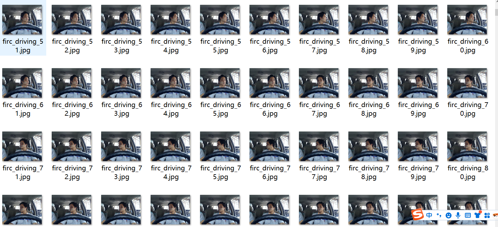
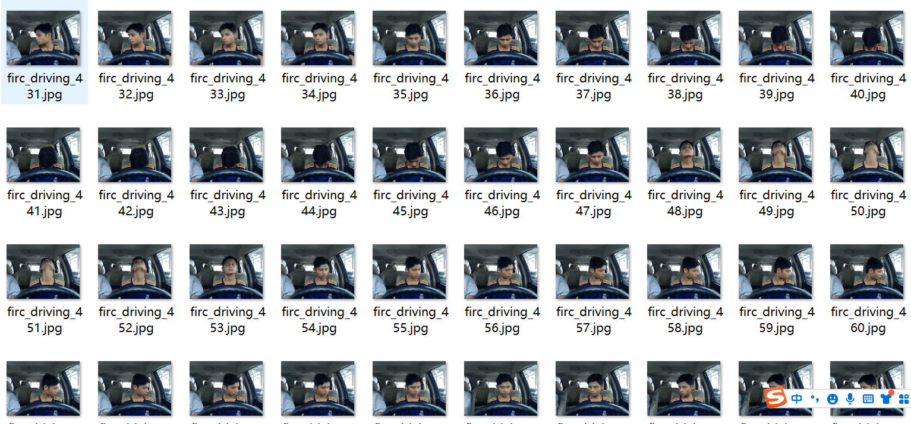
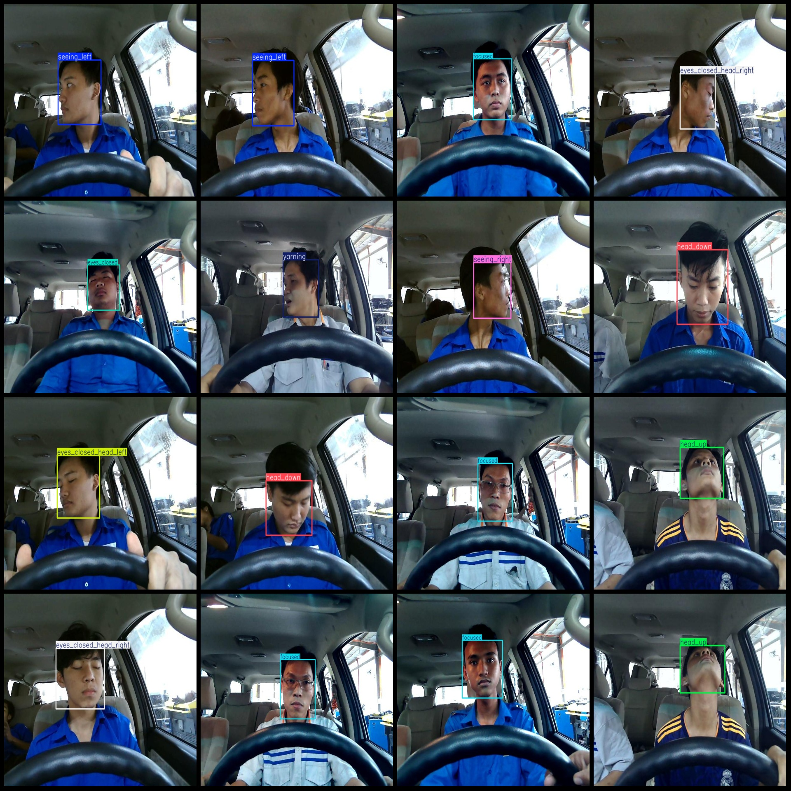
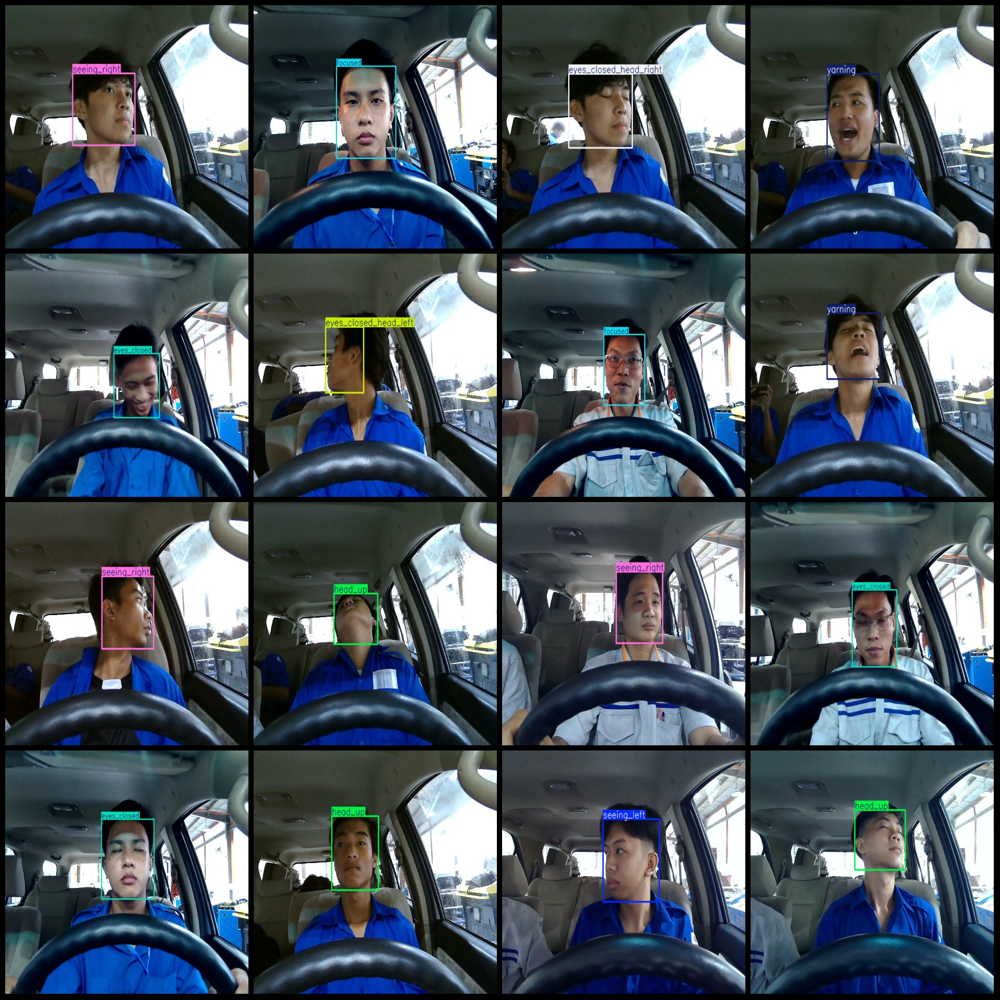

# Smart Driving, Fatigue, Drowsiness, Yawning, Head Down, Eyes Status Detection Dataset VOC+YOLO format 2661 images 9 categories

The dataset format is Pascal VOC format+YOLO format (without the split path, just the txt file containing jpg images and corresponding VOC formatxml file and yolo formattxt files).
number of images: 2661  
Number of XML files: 2661
Number of txt files: 2661
Classification: 9
Annotation class names (please note that the order in the YOLO format does not correspond to this, but is based on the classes.txt file in the labels folder): ["eyes_closed", "eyes_closed_head_left", "eyes_closed_head_right", "focused", "head_down", "head_up", "seeing_left", "seeing_right", "yarning"]
Number of boxes annotated per category:
Eyes Closed (Closed Eyes) box count = 348
"Eyes Closed Head Left (Head to the Left, Closed Eyes)" box count = 213
Eyes Closed Head Right (Head to the Right, Closed Eyes)" box count = 207
Focused (Focused) box count = 402
Head Down (Downward Facing) box count = 371
Head Up (Upward Facing) box count = 357
Seeing Left (Seeing to the Left) is translated to "Seeing Left". The number of frames equals 208.
Seeing Right (Seeing to the Right) box count = 201
Yawning (Yawning) can be translated to "Yaring".
The frame count for "Yawning" is 355, which means the text has been transcribed into 355 frames.
Total frames: 2662
Image resolution: 640x480
Application Areas: Common behaviors in Driver or Operator State Monitoring (DMS).
Using the annotation tool: labelImg
Rules for annotation: Draw a rectangle around the category.
Important Notice: None
Special Statement: This dataset does not guarantee the accuracy of the trained models or the weights files.
Image Preview:
## Images

Here is a pay link on Stripe ( https://buy.stripe.com/3cs8yP7sY87d0vu9AB ). Please contact me lonlonago@foxmail.com after funding $89, and I will send you a complete data files , thank you!

